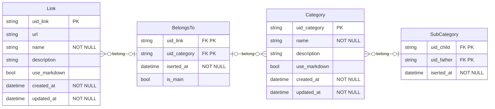

# luof-go

Implementação em **Go** do Back-end do **Luof**.

### Arquitetura

O projeto é baseado na **arquitetura hexagonal**, conhecida também como portas e adaptadores.

### Modelagem

O **core** do projeto é exemplificado no seguinte diagrama:

Essa modelagem deve servir como base para que as operações abaixo sejam realizadas:

* Operações de CRUD sobre **links**
* Operações de CRUD sobre **categorias**
* Operações e agrupamentos simples de **links** por **categorias**

### Próximas etapas

- [X] Testes para link e category use cases
- [ ] Testes para belongs to use cases
- [ ] Adaptador SQLite
- [ ] API

### Projeto inicial

Esse repositório é parte de uma reformulação do projeto de mesmo nome disponibilizado no repositório https://github.com/mutannejs/luof, projeto implementando em **C** e somente com CLI.

### Principais referências

* Ports & Adapters Examples: https://github.com/nrjohnstone/ports-adapters-examples
* Hexagonal Architecture in Go: https://medium.com/@matiasvarela/hexagonal-architecture-in-go-cfd4e436faa3
