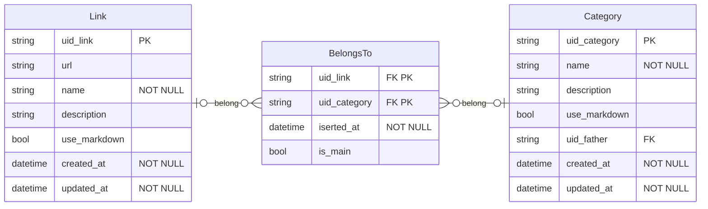

# luof-go

Implementação em **Go** do Back-end do **Luof**.

### Arquitetura

O projeto é baseado na **arquitetura hexagonal**, conhecida também como portas e adaptadores.

### Modelagem

O **core** do projeto é exemplificado no seguinte diagrama:


```mermaid
erDiagram
	direction LR
	Link o|--o{ BelongsTo : belong
	BelongsTo o{--o| Category : belong
	Link {
		string uid_link "PK"
		string url
		string name "NOT NULL"
		string description
		bool use_markdown
		datetime created_at "NOT NULL"
		datetime updated_at "NOT NULL"
	}
	BelongsTo {
		string uid_link "FK PK"
		string uid_category "FK PK"
		datetime iserted_at "NOT NULL"
		bool is_main
	}
	Category {
		string uid_category "PK"
		string name "NOT NULL"
		string description
		bool use_markdown
		string uid_father "FK"
		datetime created_at "NOT NULL"
		datetime updated_at "NOT NULL"
	}
```

Essa modelagem deve servir como base para que as operações abaixo sejam realizadas:

* Operações de CRUD sobre **links**
* Operações de CRUD sobre **categorias**
* Operações e agrupamentos simples de **links** por **categorias**

### Próximas etapas

- [ ] Documentar

### Testes

Os testes foram implementados utilizando o Testify. Para executar os testes definidos em um pacote, basta entrar na pasta do pacote e executar:

```sh
go test
```

Pode-se passar o argumento `-v` para incluir na saída todos os testes executados e seu resultado, não somente um resumo dos resultados (como ocorre por padrão).

Alguns pacotes possuem possibilidades de testes para ser executados, por exemplo:

* O `TestNew` do pacote `luuid` testa a função `luuid.New`, que pode falhar de forma imprevisível, por isso, pode-se passar a tag `luuid_error` para testar o caso em que `luuid.New` falha, ou não passar nehuma tag para testar o fluxo padrão:

```sh
go test -tags luuid_error
```

### Projeto inicial

Esse repositório é parte de uma reformulação do projeto de mesmo nome disponibilizado no repositório https://github.com/mutannejs/luof, projeto implementando em **C** e somente com CLI.

### Comandos Úteis

* `go vet ./...`: valida todos os arquivos go do projeto
* `go mod tidy`: reorganiza os arquivos go.mod e go.sum
* `go run ./cmd/api/main.go`: executa o projeto api no ambiente definido em `.env`, ou `dev` se não definido
* `go run ./cmd/api/main.go -test`: executa o projeto api no ambiente de `test`
* `go run ./cmd/api/main.go -env=dev`: executa o projeto api no ambiente de `dev`

### Principais referências

* Ports & Adapters Examples: https://github.com/nrjohnstone/ports-adapters-examples
* Hexagonal Architecture in Go: https://medium.com/@matiasvarela/hexagonal-architecture-in-go-cfd4e436faa3
* Testing in Go with Testify: https://betterstack.com/community/guides/scaling-go/golang-testify/
